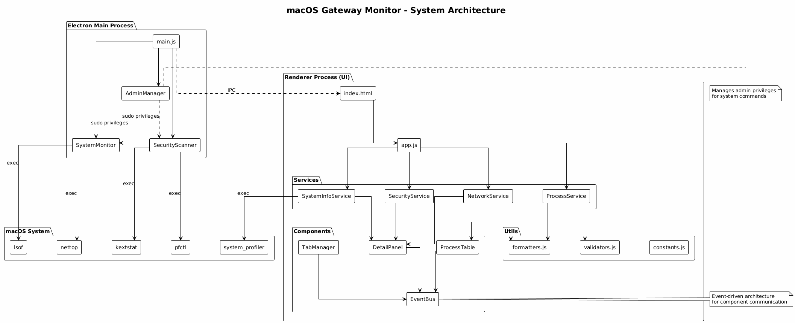
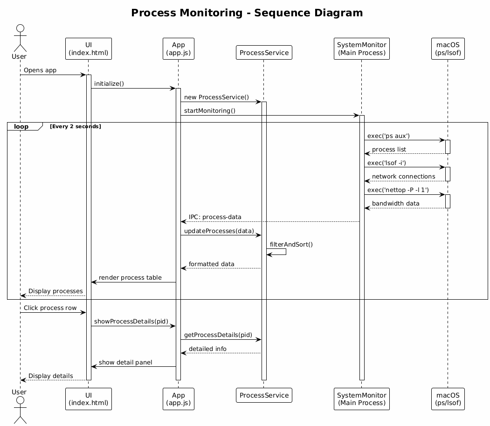
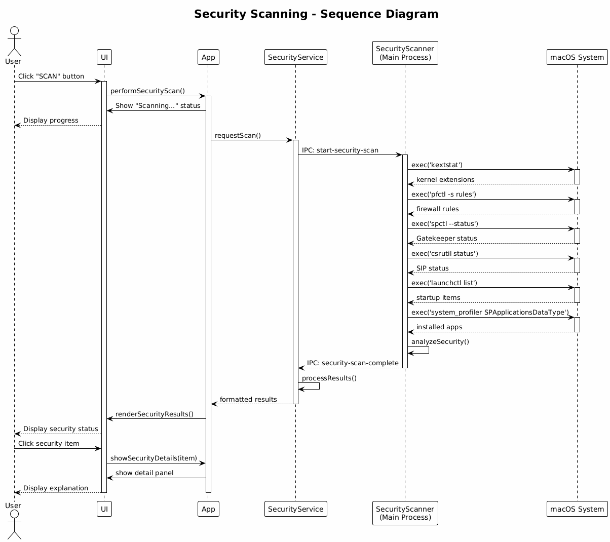
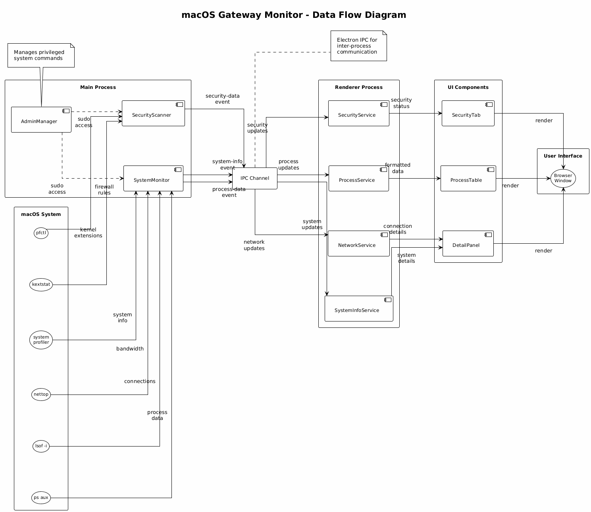

<h1 align="center">
  
  macOS Gateway Monitor v0.0.1
</h1>

[](https://opensource.org/licenses/MIT)
[](https://www.apple.com/macos/)
[](https://nodejs.org/)
[](https://www.electronjs.org/)

A developer-friendly macOS monitoring tool for deep system analysis and network visibility. Designed for developers, security professionals, and anyone interested in understanding egress/ingress traffic patterns, process-level network activity, and OS-layer diagnostics. Built with Electron for native performance and modern UI.

**Key Capabilities:**
- 🔍 **Process-Level Network Tracking**: See which applications are making network connections and consuming bandwidth
- 🌐 **Egress/Ingress Analysis**: Monitor all TCP, UDP, and Unix socket connections with real-time state tracking
- 🔒 **Security Deep Dive**: Inspect kernel extensions, firewall rules, Gatekeeper status, SIP configuration, and startup items
- 📊 **OS-Layer Diagnostics**: Drill down into routing tables, ARP cache, DNS configuration, and network interfaces
- 💻 **System Profiling**: Complete hardware/software inventory with development environment details
- 🎯 **Admin Privilege Management**: Graceful handling of privileged operations with passwordless sudo support

## Installation

### Homebrew (Recommended)

```bash
# Add the tap
brew tap 13shivam/mgm

# Install the app
brew install --cask mgm
```

### Manual Installation

```bash
# Clone the repository
git clone https://github.com/13shivam/mgm.git
cd mgm

# Install dependencies
npm install

# Run the application
npm start
```

### Download DMG

Download pre-built installers from [Releases](https://github.com/13shivam/mgm/releases):
- **Apple Silicon (M1/M2/M3)**: Download AppleSilicon.dmg
- **Intel Macs**: Download Intel.dmg


## Screenshots

### App in Action


### Main Dashboard


### Network Monitoring


## ✨ Latest Updates

### 🔍 Enhanced Search & Navigation
- **Smart Command Search**: Click 🔍 in COMMAND header to search processes by executable, path, or arguments
- **Search Mode**: Auto-refresh continues for matching processes only while filtering out non-matches
- **Clear Search Options**: ✕ button or tab switching to exit search and return to live view
- **Visual Feedback**: Search results highlighted with green borders and term highlighting

### 🎨 Modern UI/UX Improvements
- **Unified Button Design**: Consistent gradient styling across all buttons with hover animations
- **Professional About Dialog**: Enhanced "About This Mac" with modern effects and export functionality
- **Responsive Design**: Improved layouts and animations throughout the interface
- **Status Explanations**: Network connection states now show detailed meanings and implications
- **Theme Toggle**: Smooth light/dark mode switching with animated icon transitions

### 🔒 Comprehensive Security Analysis
- **Detailed Security Scan**: Enhanced scanning with policies, applications, configurations, and file descriptors
- **Interactive Security Cards**: Click any security item for Mac-specific explanations and recommendations
- **Real-time Updates**: Security information updates automatically with manual scan options

### 🌐 Network Monitoring Enhancements
- **Process Information**: Network connections now show which process is using each connection (with admin privileges)
- **Connection State Details**: Hover tooltips explain what each connection state means for your Mac
- **Graceful Degradation**: Works with or without admin privileges, showing appropriate information levels

## Features

### Process Monitoring
- **Real-time Process Analysis**: CPU, memory, and network usage per process with live updates
- **Interactive Process Details**: Click any process for comprehensive system information
- **Smart Classification**: Visual indicators for system vs user processes with color coding
- **Advanced Search**: Search processes by name, path, or arguments with persistent filtering
- **Network Activity Tracking**: Real-time bandwidth monitoring per process (requires admin privileges)
- **Multiple Sort Options**: Sort by CPU, memory, PID, or process name with instant updates

### Network Analysis
- **Connection Monitoring**: Active TCP, UDP, and Unix socket connections with process information
- **Process Attribution**: Shows which application is using each network connection
- **Connection State Analysis**: Detailed explanations of LISTEN, ESTABLISHED, and transitional states
- **Dual View System**: Friendly explanations and raw technical data toggle
- **Clickable Network Details**: Educational information about each connection's security implications
- **Bandwidth Tracking**: Real-time network usage monitoring with graceful fallbacks

### Security Scanning
- **Comprehensive Security Analysis**: Startup items, Gatekeeper, Firewall, SIP, kernel extensions
- **Detailed Security Reports**: Expandable sections with Mac-specific recommendations
- **Enhanced Scanning**: Policies, installed applications, configuration files, and file descriptors
- **Interactive Security Cards**: Click any item for detailed explanations and security impact
- **Manual Scan Control**: On-demand security analysis with detailed reporting
- **Security Recommendations**: Actionable advice for improving system security posture

### Network Configuration
- **Routing Table Analysis**: Default gateway and local network routes with traffic flow explanations
- **Interface Status**: Network adapter configuration and status with performance information
- **ARP Table**: Local network device discovery with device identification
- **DNS Configuration**: DNS servers with provider identification, performance tips, and privacy analysis
- **Friendly Explanations**: Educational content for all network settings with Mac-specific context

### System Information
- **Professional System Overview**: Comprehensive Mac hardware and software details with export functionality
- **Hardware Information**: Model, processor, memory, graphics, storage with detailed specifications
- **macOS Details**: Version, build, kernel, uptime, security status with real-time updates
- **Development Environment**: Node.js, Electron, Xcode, Python, Git versions for developers
- **User Account Information**: Current user, permissions, shell details with security context
- **Export Functionality**: Copy complete system information as JSON to clipboard
- **Performance Metrics**: Load average, memory pressure, system health indicators

### User Experience
- **Modern Design System**: Unified button styling with gradient effects and smooth animations
- **Dark/Light Themes**: Toggle between light and dark interface themes
- **Responsive Design**: Resizable columns and adaptive layouts for different screen sizes
- **Educational Tooltips**: Comprehensive hover information for technical terms and concepts
- **Detail Panels**: Click any item for in-depth explanations with Mac-specific context
- **Professional Styling**: Clean, modern interface with gradient effects

## Architecture

For detailed architecture documentation, diagrams, and design principles, see the [Architecture Documentation](architecture/README.md).

### System Architecture


### Process Monitoring Flow


### Security Scanning Flow


### Data Flow


## Prerequisites

- **macOS**: 10.15+ (Catalina or later)
- **Node.js**: 16+ 
- **Admin Privileges**: Recommended for full functionality (network monitoring, security scanning)

## Admin Privilege Setup

# Install dependencies
npm install

# Run the application
npm start
```

### Download DMG

Download pre-built installers from [Releases](https://github.com/13shivam/mgm/releases):
- **Apple Silicon (M1/M2/M3)**: Download AppleSilicon.dmg
- **Intel Macs**: Download Intel.dmg

## Admin Privilege Setup
./setup-admin.sh

# Then run normally
npm start
```

### Option 2: Manual Passwordless Sudo
```bash
# Edit sudoers file
sudo visudo

# Add this line (replace 'yourusername'):
yourusername ALL=(ALL) NOPASSWD: /usr/bin/nettop, /usr/bin/lsof, /usr/bin/kextstat, /usr/bin/pfctl, /usr/sbin/defaults, /usr/bin/system_profiler

# Run normally
npm start
```

### Option 3: Traditional Sudo
```bash
sudo npm start
```

## Development

```bash
# Development mode with debug logging
npm run dev

# Run tests
npm test

# Run specific test suites
npm run test:unit
npm run test:integration
npm run test:coverage

# Lint code
npm run lint
npm run lint:fix

# Validate configuration
npm run validate
```

## Architecture

### Modular Design
```
src/
├── main.js                     # Electron main process with enhanced system info
├── renderer/
│   ├── app.js                  # Application bootstrap with search functionality
│   ├── index.html              # Main interface with modern styling
│   ├── services/               # Business logic layer
│   │   ├── ProcessService.js   # Process management with network integration
│   │   ├── NetworkService.js   # Network data processing with process attribution
│   │   ├── SecurityService.js  # Enhanced security analysis
│   │   └── SystemInfoService.js # Comprehensive system information
│   ├── components/             # UI components
│   │   ├── DetailPanel.js      # Enhanced information panels
│   │   ├── EventBus.js         # Event communication system
│   │   ├── TabManager.js       # Tab management with search integration
│   │   └── ProcessTable.js     # Process display with search functionality
│   └── utils/                  # Utilities
│       ├── formatters.js       # Data formatting with enhanced display
│       ├── validators.js       # Input validation and security
│       └── constants.js        # Configuration management
├── core/                       # Core system classes
│   ├── SystemMonitor.js        # Enhanced system monitoring with process attribution
│   └── AdminManager.js         # Privilege management with graceful degradation
├── security/
│   └── SecurityScanner.js      # Comprehensive security scanning
├── config/
│   └── app-config.js           # Application configuration with validation
└── tests/                      # Test suites
    ├── unit/                   # Unit tests with 50%+ coverage
    └── integration/            # Integration tests
```

### Key Features
- **Event-Driven Architecture**: Decoupled component communication with enhanced event handling
- **Service Layer**: Separated business logic from UI with comprehensive error handling
- **Search Integration**: Smart search functionality with persistent filtering and live updates
- **Comprehensive Testing**: Unit and integration test coverage with continuous validation
- **Configuration Management**: Centralized settings with validation and environment support
- **Error Handling**: Isolated error boundaries with graceful degradation and user feedback

## Interface Guide

### Process Tab
- **Color Coding**: Green (system), Blue (user), Orange (high resource usage)
- **Interactive Rows**: Click any process for detailed information and system context
- **Smart Search**: Click 🔍 in COMMAND header to search by executable, path, or arguments
- **Search Mode**: Filtered view with live updates for matching processes only
- **Clear Search**: ✕ button or tab switching to return to full live view
- **Real-time Updates**: Live CPU, memory, and network monitoring with intelligent refresh

### Network Tab
- **Process Attribution**: Shows which application is using each network connection
- **Connection Details**: Click connections for security analysis and protocol information
- **State Explanations**: Hover tooltips explain connection states and their implications
- **Real-time Monitoring**: Live connection state and bandwidth tracking with graceful fallbacks
- **Admin Integration**: Enhanced information when admin privileges are available

### Security Tab
- **Enhanced Scanning**: Comprehensive analysis including policies, applications, and configurations
- **Interactive Results**: Click security items for detailed explanations and recommendations
- **Manual Control**: On-demand security analysis with detailed reporting
- **Comprehensive Coverage**: Startup items, firewall, Gatekeeper, SIP, kernel extensions, and more
- **Mac-Specific Context**: Explanations tailored to macOS security architecture

### Network Configuration Tabs
- **Routing**: Gateway and route analysis with traffic flow explanations and performance tips
- **Interfaces**: Network adapter status with configuration details and troubleshooting
- **ARP**: Local network device discovery with identification and security analysis
- **DNS**: Server analysis with provider identification, performance tips, and privacy recommendations

### System Information
- **Professional Display**: Modern design with comprehensive hardware and software details
- **Export Functionality**: Copy complete system information as JSON for analysis or support
- **Real-time Data**: Live system metrics with automatic updates and performance indicators
- **Developer Information**: Complete development environment details for technical users

## Testing

The project includes comprehensive testing with 50%+ code coverage:

```bash
# Run all tests
npm test

# Unit tests only
npm run test:unit

# Integration tests only  
npm run test:integration

# Coverage report
npm run test:coverage

# Watch mode for development
npm run test:watch
```

### Test Coverage
- **ProcessService**: 94% coverage with comprehensive validation and search testing
- **Formatters**: 100% coverage with edge case handling and display formatting
- **Integration Tests**: End-to-end application flow testing including search functionality
- **Error Handling**: Graceful degradation and error boundary testing with user feedback
- **Search Functionality**: Comprehensive testing of search modes and state management

## Configuration

Application behavior can be customized through `src/config/app-config.js`:

- **Refresh Intervals**: Process and network update frequencies with search mode optimization
- **Security Scanning**: Enhanced scan intervals and comprehensive analysis thresholds
- **UI Preferences**: Theme, animation, search behavior, and display settings
- **Performance**: Caching, limits, search optimization, and system resource management
- **Search Settings**: Filter persistence, refresh behavior, and result highlighting

## Troubleshooting

### Network Monitoring Issues
- **"Network usage requires admin privileges"**: Enhanced privilege handling with graceful degradation
- **Process column shows "unknown"**: Normal behavior when admin privileges unavailable
- **Connection information missing**: Admin privileges provide enhanced process attribution

### Performance Issues
- **High CPU usage**: Optimized refresh intervals with search mode considerations
- **Memory usage**: Enhanced process list management with intelligent filtering
- **Search performance**: Optimized filtering with live update management

### Search Issues
- **Search results not updating**: Check admin privileges for enhanced process monitoring
- **Cannot exit search mode**: Use ✕ button or switch tabs to clear search
- **Filter not working**: Clear existing search first, then apply new filter

### Connection Issues
- **Empty process list**: Ensure proper permissions and admin access for full functionality
- **Network data missing**: Admin privileges required for comprehensive network monitoring
- **Security scan failures**: Check system permissions and security settings

## Security

This application requires admin privileges for comprehensive monitoring. Security measures include:

- **Privilege Management**: Enhanced caching and graceful degradation without admin access
- **Input Validation**: All user inputs sanitized and validated with comprehensive error handling
- **Error Isolation**: Component failures don't crash the application with proper error boundaries
- **macOS Security Compliance**: Follows Apple's security guidelines with enhanced integration
- **Search Security**: Safe filtering and process monitoring without privilege escalation

## Contributing

1. Fork the repository
2. Create a feature branch: `git checkout -b feature-name`
3. Make changes with tests: Ensure `npm test` passes with enhanced coverage
4. Follow code style: Run `npm run lint:fix` for consistent formatting
5. Submit a pull request with detailed description and testing information

### Development Guidelines
- **Modular Design**: Keep files under 300 lines with clear separation of concerns
- **Test Coverage**: Maintain 50%+ coverage for new code with comprehensive testing
- **Error Handling**: Include proper error boundaries with user-friendly feedback
- **Documentation**: Update README and code comments for new features and functionality
- **Search Integration**: Consider search functionality impact for new features

## License

MIT License - See LICENSE file for details

## Support

For issues, feature requests, or questions:

1. **Check Troubleshooting**: Review common issues and solutions above
2. **GitHub Issues**: Open an issue with:
   - macOS version and hardware details from "About This Mac"
   - Node.js and Electron versions
   - Error logs from console (if any)
   - Steps to reproduce the issue including search functionality
   - System information export from the app
3. **System Information**: Use "📋 EXPORT" button in "About This Mac" for complete system details

## Changelog

### v0.0.1 (Current)
- **Enhanced Search Functionality**: Smart command search with persistent filtering and live updates
- **Modern UI/UX**: Unified button design system with gradient effects and smooth animations
- **Comprehensive Security Analysis**: Enhanced scanning with policies, applications, configurations, and file descriptors
- **Network Process Attribution**: Shows which applications are using network connections (with admin privileges)
- **Professional System Information**: Complete hardware/software details with JSON export functionality
- **Improved Error Handling**: Graceful degradation and comprehensive user feedback
- **Modular Architecture**: Service layer separation with comprehensive testing suite
- **Real-time Monitoring**: Enhanced process, network, and security monitoring with intelligent refresh
- **Educational Interface**: Mac-specific explanations and context throughout the application
- **Admin Privilege Integration**: Enhanced functionality with proper fallbacks for limited access

